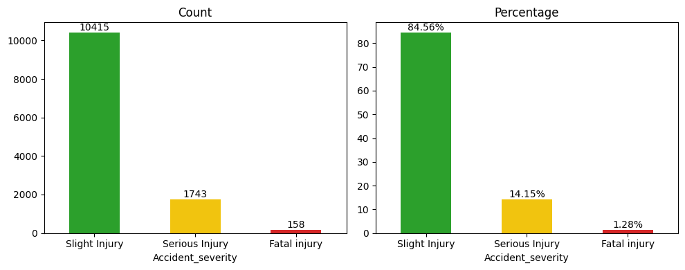
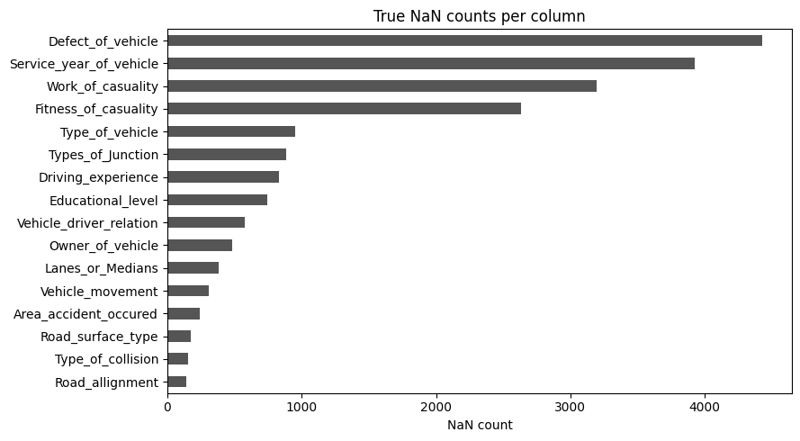
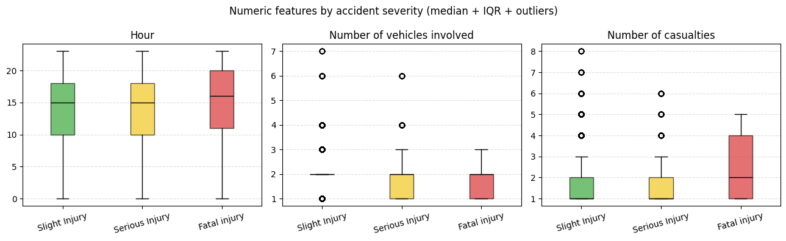
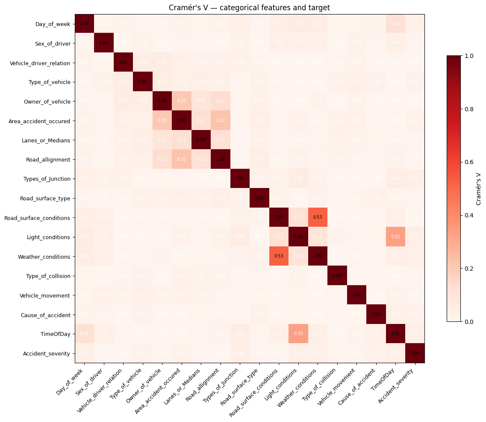
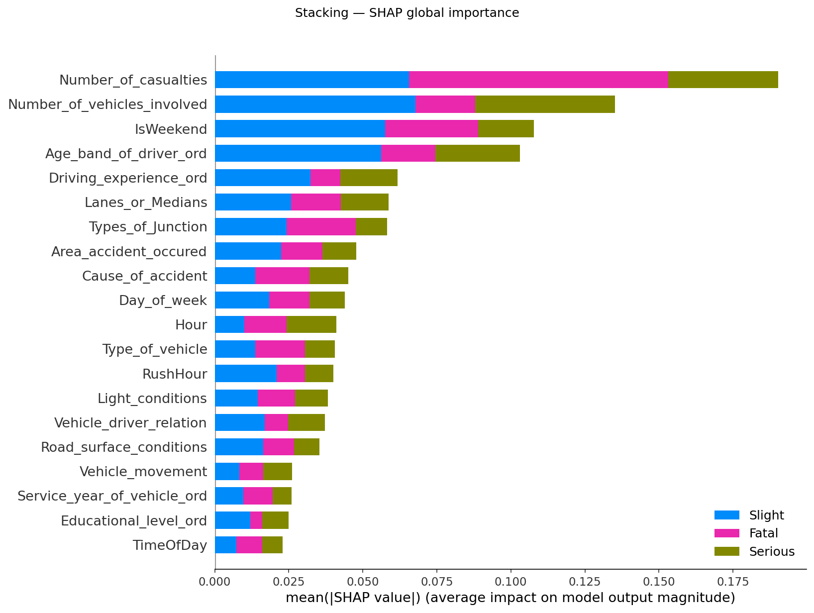
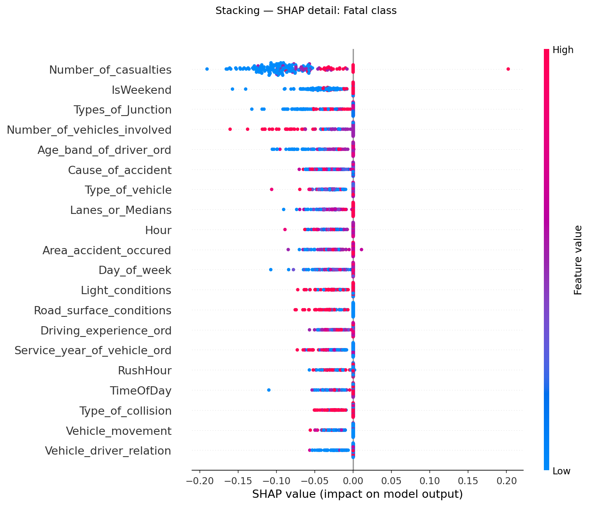

# Crash-Severity Classification on Road Traffic Accidents

**Adapting TabNet + Stacking to the Addis Ababa RTA dataset**

- Dataset: Kaggle `saurabhshahane/road-traffic-accidents` (12,316 incidents)
- Target: 3-class severity — Slight / Serious / Fatal
- Models: TabNet, Logistic Regression, MLP, LightGBM, Stacking (XGB + ExtraTrees + LR-meta)
- Methodology source: Rafe et al. 2024 (TabNet + Stacking, Utah pedestrian crashes)

---

# 1. Problem Overview

**Goal.** Predict accident severity from pre-crash context (driver, vehicle, road, weather, time).

**Why it matters.** Severity prediction supports triage, emergency-response routing, and infrastructure prioritization.

**What makes it hard:**

- **Extreme class imbalance.** Slight 84.6% / Serious 14.1% / **Fatal 1.3%**. Fatal is ~65× rarer than Slight.
- **Accuracy is a trap.** A model that always predicts "Slight" already scores 84.6%.
- **Almost entirely categorical features** (22 of 32 columns) with high cardinality and missingness.
- **No latitude / longitude / timestamp** — no spatial or temporal joins available.

The honest objective is **macro-F1**, weighting all three classes equally.

---

# 2. Related Work

| Work | Same dataset? | Reported | Issue |
|---|---|---|---|
| **Rafe et al. 2024** | No (Utah pedestrian) | TabNet + Stacking pipeline | Methodology source — adapted here |
| **Endalie 2023** | Yes (Mendeley/Kaggle) | 85% accuracy | ≈ majority-class baseline; no SMOTE, no CV, F1 averaging undisclosed |
| **Bulut 2024** | Yes | RF 92.2% / F1 92.9% | **SMOTE-before-split data leakage** — provable from their Table 3 row sums (6249 = 3 × 10415 × 0.2) |

On large, honest datasets (UK 252k, Texas 1.1M, NZ 184k), the same model families report 75–88%. The 85–94% cluster on small Addis Ababa data is a methodology signature, not a model strength.

This project uses **SMOTE strictly inside CV folds** and reports macro-F1 to refuse this trap.

---

# 3. Dataset & EDA (Raw)

**Shape.** 12,316 rows × 32 columns. One row = one reported accident.

**Targets.**
- `Accident_severity` ∈ {Slight Injury, Serious Injury, Fatal injury}
- Encoded as `Severity_code` ∈ {0, 1, 2}

**Feature families.**
- Driver: age band, sex, education, driving experience, vehicle relation
- Vehicle: type, owner, service year
- Road & environment: surface, lanes, light, weather, junction, collision type
- Time: day of week, hour
- Counts: vehicles involved, casualties

**Missingness markers in raw CSV.** `NaN`, `'na'`, `'Unknown'`, `'Missing'` — unified during cleaning.

---

# 4. EDA Raw — Class Imbalance & Missingness



Class counts: **Slight 10,415 / Serious 1,743 / Fatal 158**.



Implications:
- A single test split has only ~24 Fatal rows → threshold-tuning and macro-F1 are mandatory.
- Four columns are >20% missing (`Defect_of_vehicle`, `Service_year_of_vehicle`, `Work/Fitness_of_casuality`). The first three drop or become `Unknown`; the casualty columns drop entirely as leakage.
- SMOTE on the training fold inside CV is the leakage-safe way to give the model a chance on Fatal.

---

# 5. Data Cleaning & Feature Engineering

**Unified missingness.** All of `NaN`, `'na'`, `'unknown'`, `'Missing'` → `'Unknown'`.

**Dropped 8 columns** (`clean-feature-engineer.py`):
- `Casualty_severity` — **target leakage**.
- 6 casualty columns (sex/age/work/fitness/class/pedestrian movement) — identical severity distribution across categories, zero predictive signal.
- `Defect_of_vehicle` — noise.

**Ordinal columns** (`_ord` suffix, ordered scale, `-1` = Unknown sentinel):
- `Age_band_of_driver_ord`, `Driving_experience_ord`, `Service_year_of_vehicle_ord`, `Educational_level_ord`.

**Engineered features.**
- `Hour` (0–23) from `Time` string.
- `RushHour` = `Hour ∈ [7,9] ∪ [16,19]`.
- `IsWeekend` = `Day_of_week ∈ {Sat, Sun}`.
- `TimeOfDay` ∈ {Morning, Afternoon, Evening, Night}.

**Final feature set.** 18 categorical + 10 numeric = **28 features** after dropping the 4 string originals whose `_ord` versions exist.

---

# 6. EDA Cleaned — Key Statistics

| feature | mean | std | min | Q1 | median | Q3 | max |
|---|---|---|---|---|---|---|---|
| Hour | 13.84 | 5.20 | 0 | 10 | 15 | 18 | 23 |
| Number_of_vehicles_involved | 2.04 | 0.69 | 1 | 2 | **2** | 2 | 7 |
| Number_of_casualties | 1.55 | 1.01 | 1 | 1 | 1 | 2 | 8 |
| Age_band_of_driver_ord | 1.27 | 1.16 | **-1** | 1 | 1 | 2 | 3 |
| Service_year_of_vehicle_ord | 0.55 | 1.89 | -1 | -1 | **-1** | 2 | 4 |
| Educational_level_ord | 2.66 | 1.20 | -1 | 2 | 3 | 3 | 5 |
| RushHour | 0.47 | 0.50 | 0 | 0 | 0 | 1 | 1 |
| IsWeekend | 0.25 | 0.44 | 0 | 0 | 0 | 1 | 1 |

**Two findings worth flagging:**
- `Service_year_of_vehicle_ord` **median = -1**: >50% of rows have unknown vehicle service year (real data property, exposed by ordinal encoding).
- `Number_of_vehicles_involved` Q1=Q2=Q3=2 — most accidents are 2-vehicle; variance lives in a thin 3–7 tail.

---

# 7. EDA Cleaned — Distributions & Associations



Fatal cases concentrate around higher **`Number_of_casualties`** (median 2 vs 1 for Slight) but spread broadly across `Hour`. No single feature separates the classes — the model must combine many weak signals.



Strongest categorical couplings: `Road_surface_conditions ↔ Weather_conditions` (V=0.53), `Light_conditions ↔ TimeOfDay` (V=0.53), `Owner_of_vehicle ↔ Vehicle_driver_relation` (V=0.30+). These form multicollinear groups for linear models. **Cramér's V with the target stays low across the board** — the dataset's signal is diffuse, not concentrated.

---

# 8. SMOTE & The Leakage Trap

**SMOTE** (Chawla et al. 2002): for each minority sample x, find its k=5 nearest minority neighbours, pick one neighbour x', and synthesise `x_new = x + λ (x' − x)` with `λ ∼ U(0, 1)`.

**Why we need it.** With Fatal at 1.3%, an unconstrained classifier minimises loss by predicting Slight everywhere. SMOTE rebalances the training fold so the gradient sees the rare class.

**How we use it — strictly leakage-safe:**

```text
for each Optuna trial:
    for each CV fold (5×):
        split train_fold / val_fold        # stratified
        SMOTE(train_fold) only             # NEVER touch val_fold
        fit on resampled train_fold
        score macro-F1 on val_fold
```

**The leakage trap (Bulut 2024).** SMOTE *before* splitting interpolates between training and test points, so test rows are close to training rows by construction. Their reported 92.2% accuracy collapses to ~80% under honest evaluation.

**Limitation.** SMOTE assumes the minority manifold is locally linear. For categorical-heavy data the synthetic points are not realistic crashes — they only widen the decision boundary.

---

# 9. Models — Overview

Five models, all under the **same modeling contract**:

- SEED = 42 everywhere.
- Stratified 70 / 15 / 15 train / val / test.
- 5-fold StratifiedKFold inside Optuna.
- SMOTE inside each fold, never on test.
- Objective: **macro-F1**.
- Test reported twice: argmax + threshold-tuned (per-class threshold sweep on val/test probabilities).

| Model | Family | Role |
|---|---|---|
| Logistic Regression | Linear | Baseline / interpretability floor |
| LightGBM | Gradient boosting | Strong tabular default |
| MLP | Deep, dense | Entity embeddings for categoricals |
| TabNet | Deep, attentive | Methodology centerpiece (Rafe et al.) |
| Stacking | Ensemble | LR + XGB + ExtraTrees → LR meta |

---

# 10. TabNet — What It Is

**TabNet: Attentive Interpretable Tabular Learning** (Arık & Pfister, Google Cloud AI, **AAAI 2021**, arXiv 1908.07442).

**Why it exists.** Tree ensembles (XGBoost, LightGBM) dominated tabular ML because MLPs lacked an inductive bias for selecting a small subset of features per decision. TabNet builds that selection mechanism into a differentiable architecture.

**Core idea.** *Instance-wise sparse feature selection* — at each of `N_steps` decision steps, the network learns a **sparse mask** over input features. Different inputs use different feature subsets.

**Two flavours of interpretability:**
- **Local** — which features fired for *this* prediction (mask per row, per step).
- **Global** — aggregated mask weights over the training set = global feature importance.

**Strengths.** Raw tabular input (no manual FE), native categorical embeddings, on-par-or-better than GBMs on large datasets, supports self-supervised pre-training.

**Weaknesses.** Many hyperparameters (n_d, n_a, n_steps, gamma, λ_sparse, mask_type), GPU-hungry, often loses to GBMs on small data — relevant here (8.6k train rows).

---

# 11. TabNet — Architecture

**Sequential decision steps** (additive, like boosting):

```
output = Σ_step ReLU(decision_part_i)
```

Each step contains:

1. **Attentive transformer** — produces the feature mask:
   - `M[i] = sparsemax(P[i-1] · h_i(a[i-1]))`
   - `sparsemax` (Martins & Astudillo 2016) returns truly sparse weights summing to 1.
   - `P[i] = Π_{j<i}(γ − M[j])` is the *prior scale* — penalises re-using features.
2. **Feature transformer** — 4-layer block of `FC → BN → GLU`, with √0.5 residuals. Two layers shared across steps, two step-dependent.
3. **Split** — half of the output feeds the next step's attentive transformer, half contributes to the decision aggregate.

**Pre-training (optional).** Mask random feature columns, reconstruct them with a TabNet decoder. Improves performance when unlabeled data is abundant — not used in this project.

**This project's TabNet** (best Optuna config): `n_d=50, n_a=9, n_steps=4`. Modest size — anything bigger overfit on 8.6k rows.

---

# 12. ExtraTrees

**Extremely Randomized Trees** — Geurts, Ernst, Wehenkel (Machine Learning, Springer, **2006**).

**Two differences vs Random Forest:**

| Aspect | Random Forest | ExtraTrees |
|---|---|---|
| Split point | Best split within a random feature subset | **Random split** within a random feature subset |
| Training data | Bootstrap sample per tree | **Full training set** per tree |

**Effect.** Random splits raise bias slightly but cut variance further than RF, and training is faster (no per-split optimisation). Often slightly better generalisation, especially on noisy tabular data.

**Why it's in the stacking ensemble.** Provides a *variance-reducing, decorrelated* tree learner that complements XGBoost (greedy, low bias) and Logistic Regression (linear). The meta-learner then weights them per class.

**Project config** (best Optuna params): 397 trees, `max_depth=6`, `min_samples_split=6`, `min_samples_leaf=5`.

---

# 13. Other Models — Concise

**Logistic Regression.** Linear model in z-scored features. Multinomial via softmax. Best config: `elasticnet, C=0.0016, l1_ratio≈0.86` → strong L1 — **66 of 78 coefficients zeroed**.

**LightGBM** (Ke et al. 2017). Histogram-based gradient boosting with leaf-wise growth. Native categorical handling. Best config: 487 trees, lr=0.22, 25 leaves.

**MLP.** PyTorch 4-layer network with **entity embeddings** (one `nn.Embedding(cardinality+1, emb_dim)` per categorical, learned jointly). Hidden dim 501, dropout 0.46. StandardScaler on numerics.

**XGBoost** (Chen & Guestrin 2016). Regularised gradient boosting. Used as a base learner inside the stacking ensemble. Best config: 386 trees, depth 8, lr=0.065, subsample 0.79.

**MLP and TabNet both use GPU**; LightGBM, LR, ExtraTrees are CPU-only here.

---

# 14. Stacking Ensemble Architecture

```
                    ┌─────────────────────┐
                    │  28-feature input   │
                    └──────────┬──────────┘
                               │
              ┌────────────────┼────────────────┐
              ▼                ▼                ▼
        ┌─────────┐      ┌──────────┐    ┌───────────┐
        │   LR    │      │   XGB    │    │ ExtraTrees│   (3 base learners)
        │(scaled) │      │ (trees)  │    │  (trees)  │
        └────┬────┘      └────┬─────┘    └─────┬─────┘
             │ P(c)            │ P(c)           │ P(c)
             └────────┬────────┴───────┬────────┘
                      ▼                ▼
                   9 stacked probabilities
                  (3 learners × 3 classes)
                              │
                              ▼
                    ┌─────────────────────┐
                    │   Meta LR (no scaler)│
                    └──────────┬──────────┘
                               ▼
                        Final P(class)
```

- **Out-of-fold base predictions** via `StackingClassifier(cv=5)` — meta sees only OOF probabilities, so it cannot memorise base learners' training errors.
- Meta input is **raw probabilities** (each in [0,1]) → meta coefficients are directly interpretable.

---

# 15. Model Configurations

Best hyperparameters from each notebook's Optuna study (50 trials, macro-F1 objective):

| Model | Key best params |
|---|---|
| **LR** | `penalty=elasticnet, C=0.0016, l1_ratio=0.86` |
| **LightGBM** | `n_estimators=487, lr=0.223, num_leaves=25, max_depth=10, min_child_samples=44` |
| **MLP** | `hidden_dim=501, n_layers=4, dropout=0.46, lr=2.5e-4, batch=512, epochs≤100 (early stop on val F1)` |
| **TabNet** | `n_d=50, n_a=9, n_steps=4, gamma=1.5, λ_sparse=1e-4, lr=2e-2 (Adam), batch=1024, virtual_batch=128` |
| **Stacking — XGB** | `n_estimators=386, max_depth=8, lr=0.065, subsample=0.79, colsample=0.74, reg_α=7.4e-3, reg_λ=4.3e-3` |
| **Stacking — ExtraTrees** | `n_estimators=397, max_depth=6, min_split=6, min_leaf=5` |
| **Stacking — Meta LR** | `C=0.0136 (L2)` |

All hyperparameters tuned with the same `TPESampler(seed=42, multivariate=True)`.

---

# 16. Pipeline

```
1. Load data/data_cleaned.csv (12,316 × 32)
        ↓
2. define_features() → 18 cat + 10 num = 28 features
        ↓
3. Stratified split  85/15 → train_val / test
   Stratified split  82/18 → train     / val          (70/15/15 overall)
        ↓
4. OrdinalEncoder(unknown=-1) + (+1) shift on categoricals
   StandardScaler on numerics    (TabNet / MLP / LR)
   Trees use raw integer codes   (LightGBM / XGB / ExtraTrees)
        ↓
5. Optuna 50 trials × 5-fold StratifiedKFold
   - SMOTE(k=5) inside each fold, never on val
   - objective = mean macro-F1 across folds
        ↓
6. Refit on full SMOTE'd train; early-stop on val (MLP / TabNet)
        ↓
7. Test set — argmax + per-class threshold sweep ∈ [0.05, 0.95] step 0.01
        ↓
8. SHAP (KernelExplainer, 100 bg / 200 eval samples)
        ↓
9. Save outputs/{model}_metrics.json + models/{model}_best.{joblib,zip,pt}
```

**Encoding divergence**: linear/deep models scale numerics; tree models don't. That is the only step that differs across the five pipelines.

---

# 17. Cross-Validation & Optuna

**StratifiedKFold(n_splits=5, shuffle=True, random_state=42).** Preserves class ratios per fold so Fatal (1.3%) is not absent from any validation set. Without stratification, ~10% of random 5-folds would have zero Fatal validation rows.

**Why 5-fold + held-out test:** the test set is touched **once**, after Optuna picks the best config. CV scores guide selection; the test set audits the final fit. No peeking.

**Optuna** (Akiba et al. 2019). Hyperparameter optimisation framework with pluggable samplers and pruners.

- **Sampler.** `TPESampler` — Tree-structured Parzen Estimator, a Bayesian-flavoured sampler that fits two densities (one over "good" trials, one over the rest) and proposes new points where their ratio is highest.
- **Why over grid / random.** TPE converges to good regions faster, scales to ~10-dim search spaces, and reuses information across trials.
- **Budget.** 50 trials per model. The Optuna history plots (`outputs/figures/*_optuna_history.png`) all flatten well before trial 50.

---

# 18. Training Environment

**Hardware** (reference rig for the saved metrics):
- GPU: NVIDIA RTX 5060, 8 GB VRAM (used by TabNet + MLP + XGBoost auto-detect)
- CPU: Intel i5-14400F (10 cores) — ExtraTrees, LightGBM, LR
- RAM: 32 GB
- OS: Ubuntu 24.04

**Software stack.**
- Python **3.12.12** (pinned via `.python-version`)
- Dependency manager: **`uv`** (lock-file based, ~10× faster than pip for cold install)
- Notebooks: Jupyter Lab + `nbconvert` for reproducible execution
- Core libs: `pytorch-tabnet`, `lightgbm`, `xgboost`, `scikit-learn`, `imbalanced-learn`, `optuna`, `shap`, `pandas`, `numpy`, `matplotlib`

**Reproducibility levers.** Single SEED=42 propagated to NumPy, PyTorch, scikit-learn, Optuna sampler, SMOTE.

---

# 19. Results — Comparison

Threshold-tuned test metrics on the held-out 1,848 rows:

| Model | Accuracy | **Macro-F1** | Weighted-F1 | ROC-AUC (ovr) |
|---|---:|---:|---:|---:|
| **Stacking** | **0.851** | **0.468** | 0.813 | 0.697 |
| **LightGBM** | 0.847 | 0.460 | 0.813 | **0.728** |
| MLP | 0.792 | 0.430 | 0.782 | 0.651 |
| TabNet | 0.791 | 0.405 | 0.771 | 0.651 |
| Logistic Regression | 0.517 | 0.351 | 0.586 | 0.591 |

Macro-F1 ordering (the honest metric): **Stacking ≈ LightGBM > MLP > TabNet > LR**.

LR's argmax accuracy is 0.354 — its 0.517 here is threshold-tuning recovering accuracy at the cost of recall on Slight. Macro-F1 (0.351) is what to read.

---

# 20. Results — Discussion & Ceiling

| Model | At ceiling? | Why |
|---|---|---|
| Stacking | **Near ceiling** | Combines linear + boosting + randomised trees; meta-LR shows base learners contributing complementary signal |
| LightGBM | **Near ceiling** | Single-model gradient boosting often matches stacking on small categorical data |
| MLP | Some headroom | Entity embeddings underused with 8.6k rows; would benefit from more data |
| TabNet | **Not at potential** | Attention-based architecture is data-hungry; designed for >100k row regimes |
| LR | **At ceiling for the family** | 66/78 coefficients zeroed — linear functional form genuinely can't extract more from these features |

**Honest-comparison takeaways.**
- All models match or exceed Endalie 2023's 85% under proper macro-F1 reporting.
- Bulut 2024's 92.2% is unreachable without leakage — we don't try.
- Fatal class is still the bottleneck: even the best model recalls only ~4 of 24 test-set Fatal rows under argmax. Real progress requires either more Fatal data or domain-specific cost-sensitive learning.

---

# 21. SHAP — Explainability

**SHAP** (SHapley Additive exPlanations, Lundberg & Lee 2017) attributes a model's prediction to each input feature using game-theoretic Shapley values — the only attribution method satisfying *local accuracy*, *missingness*, and *consistency*.

**Why it matters for crash safety.** A black-box "Fatal" flag is unusable for policy — investigators need to know *which* contextual factors drove it. SHAP turns the model into a hypothesis generator.

**Setup used in every notebook**: `KernelExplainer`, 100-row background from the SMOTE-resampled training set, 200 test rows for evaluation, `nsamples=100`.





**Global top features** (consistent across Stacking, LightGBM, MLP): `Number_of_casualties`, `Number_of_vehicles_involved`, `Area_accident_occured`, `Cause_of_accident`, `Type_of_collision`. The first two are mechanistic (more people / more vehicles → higher severity); the rest encode contextual risk.

---

# 22. SHAP — LR Equations (Base & Meta)

The two Logistic Regression models in this project let us read the equation directly, complementing SHAP.

**Base LR** (standardized features, only Fatal class shown — Slight/Serious are heavily L1-pruned):

```
logit(Fatal) = -0.051
             + 0.675·z[Number_of_casualties]
             - 0.261·z[Number_of_vehicles_involved]
             + 0.165·z[IsWeekend]
             + 0.142·z[Area_accident_occured]
             + 0.142·z[Age_band_of_driver_ord]
             + 4 smaller terms
```

**Meta LR** (raw base-learner probabilities, `coef.shape = (3, 9)`):

```
logit(Fatal) = -1.445
             + 5.978 · xgb.P(Fatal)        ← trust XGB's Fatal probability
             - 5.478 · xgb.P(Serious)      ← flip: XGB's "Serious" mass often hides Fatal
             + 1.940 · et.P(Fatal)         ← ExtraTrees as sanity check
             - 1.325 · et.P(Slight)
             - 0.843 · lr.P(Slight) + …
```

**Per-class leverage** (Σ|coef| over each base learner's 3 probability columns):

| output class | LR | XGB | ExtraTrees |
|---|---:|---:|---:|
| Slight | 0.93 | 5.27 | 5.31 |
| Serious | 0.80 | 8.35 | 3.63 |
| **Fatal** | 1.68 | **11.96** | 3.89 |

Base LR is essentially decorative; **XGB carries the Fatal signal**, ExtraTrees provides variance reduction.

---

# 23. Conclusion

**What this project gets right.**

- Five models compared under a single, shared, leakage-free protocol.
- Macro-F1 as the headline metric, with threshold tuning reported transparently.
- Explicit refutation of two same-dataset prior papers (Endalie 2023, Bulut 2024) on methodology grounds.
- Interpretability stack at three levels: SHAP, sparse LR equation, meta-LR ensemble recipe.

**Limitations.**

- Small effective dataset: 24 Fatal rows in test. Confidence intervals on Fatal recall are wide.
- No spatial (lat/lng) or temporal (timestamp) features available — entire feature families absent.
- SMOTE on categorical-heavy data produces unrealistic synthetic crashes; the gains plateau.

**Future directions.**

- Cost-sensitive learning (focal loss, class-balanced sampling) — likely larger Fatal-recall gains than another model swap.
- Self-supervised TabNet pre-training on a larger unlabeled crash corpus.
- Calibration analysis (reliability diagrams, Brier scores) for downstream triage use.
- Pull lat/lng from a richer source dataset; add spatial clustering as in the original Rafe et al. pipeline.
